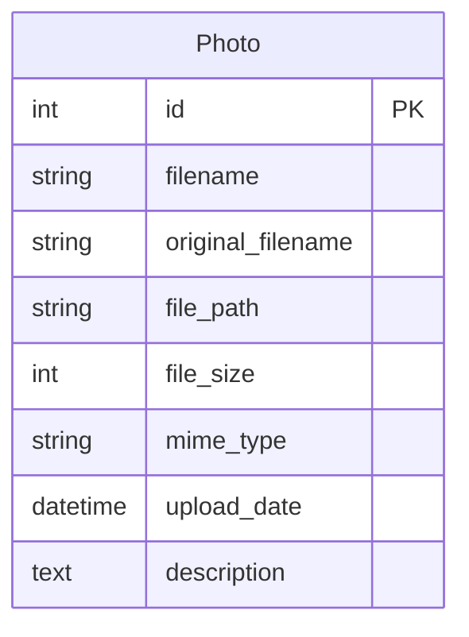
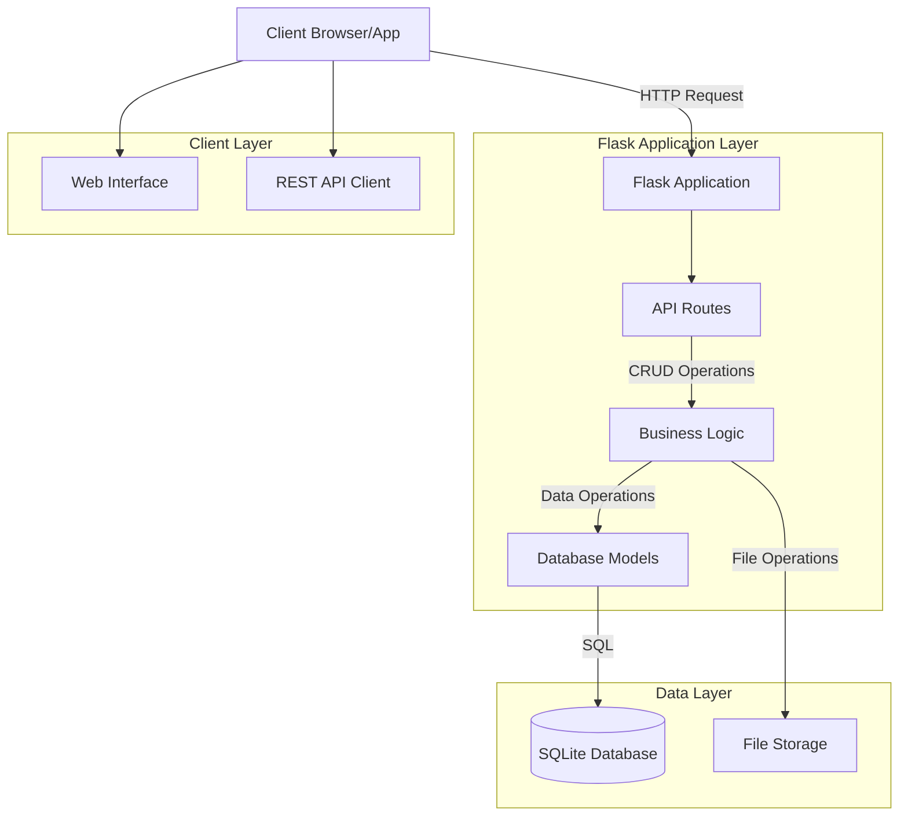
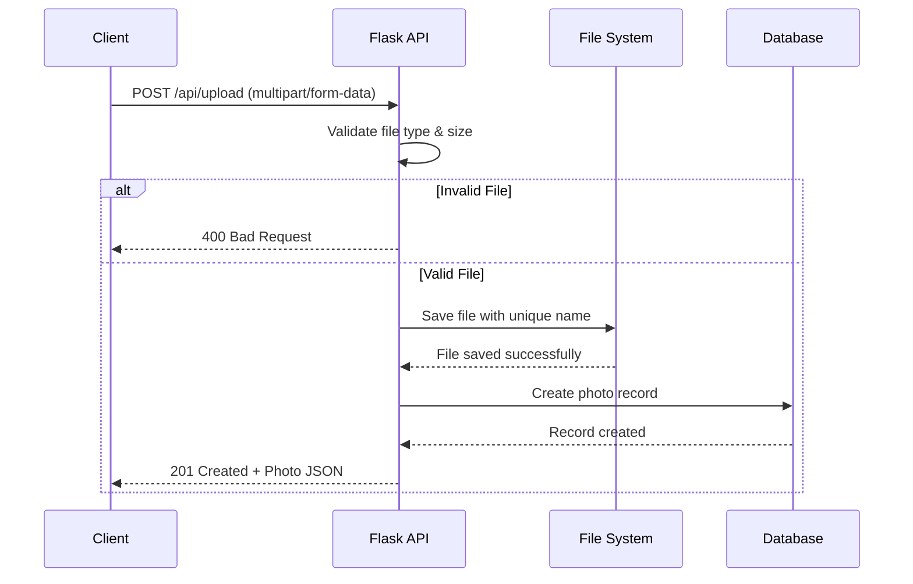
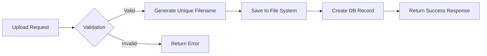

# Photo Gallery API Documentation

## Overview

A RESTful API for a Flask-based photo gallery application that allows users to upload, view, and manage photos with metadata storage.

### API Base URL
```text
http://localhost:5000/api
```

## Table of Contents
### Endpoints
- GET /api/photos
- POST /api/upload
- Data Models
- Error Handling
- Setup & Installation
- Architecture Diagrams

# Endpoints

## GET /api/photos

Retrieves all photos from the gallery in descending order by upload date.

URL: /api/photos

Method: GET

## Success Response:

-    Code: 200 OK

-    Content Example:

```json
[
  {
    "id": 1,
    "filename": "a1b2c3d4e5f6.jpg",
    "original_filename": "myphoto.jpg",
    "file_path": "/path/to/uploads/a1b2c3d4e5f6.jpg",
    "file_size": 2048576,
    "mime_type": "image/jpeg",
    "upload_date": "2024-01-15T10:30:00Z",
    "description": "A beautiful sunset"
  }
]
```

## POST /api/upload

Uploads a single photo to the gallery.

### URL: /api/upload

Method: POST

Content-Type: multipart/form-data

## Table Parameters:

Name        Type    Required    Description
photo       File    Yes         The image file to upload
description String  No          Optional description of the photo

### Success Response:

- Code: 201 Created
- Content Example:

```json
{
  "message": "File uploaded successfully",
  "photo": {
    "id": 2,
    "filename": "f6e5d4c3b2a1.png",
    "original_filename": "screenshot.png",
    "file_path": "/path/to/uploads/f6e5d4c3b2a1.png",
    "file_size": 1048576,
    "mime_type": "image/png",
    "upload_date": "2024-01-15T11:45:00Z",
    "description": "Application screenshot"
  }
}
```

## Error Responses:

- Code: 400 Bad Request
- Content: {"error": "No file provided"}
- Code: 400 Bad Request
- Content: {"error": "No file selected"}
- Code: 400 Bad Request
- Content: {"error": "Invalid file type"}

Allowed File Types: PNG, JPG, JPEG, GIF, WEBP
Maximum File Size: 16MB

# Data Models

## Photo Object

```json
{
  "id": "integer",
  "filename": "string",
  "original_filename": "string",
  "file_path": "string",
  "file_size": "integer",
  "mime_type": "string",
  "upload_date": "datetime",
  "description": "string"
}
```

## Database Schema



## Error Handling
The API uses standard HTTP status codes:

Code	Description
200     Success
201     Created
400     Bad Request (Client error)
404     Not Found
500     Internal Server Error

All error responses include a JSON object with an error field describing the issue.

## Setup & Installation
### Prerequisites
- Python 3.8+
- pip (Python package manager)

## Installation Steps
### Clone the repository
```bash
git clone <repository-url>
cd photo-gallery
```

### Create virtual environment
```bash
python -m venv venv
source venv/bin/activate  # On Windows: venv\Scripts\activate
```

### Install dependencies
```bash
pip install flask flask-sqlalchemy pillow
```

### Configure the application
- Update SECRET_KEY in config.py
- Ensure upload directory exists: static/uploads/

### Initialize the database
- python -c "from app import app, db; app.app_context().push(); db.create_all()"

### Run the application
```bash
python app.py
```

### Access the API
-         API Base: http://localhost:5000/api

-        Web Interface: http://localhost:5000

# Home Page:


# Home Page:


# Home Page:


# Home Page:


# Architecture Diagrams

## System Architecture


## Sequence Diagram


## Data Flow Diagram


# Usage Examples

## Uploading a Photo with cURL

```bash
curl -X POST http://localhost:5000/api/upload \
  -F "photo=@/path/to/your/image.jpg" \
  -F "description=A beautiful landscape"
```

## Fetching All Photos with cURL

```bash
curl http://localhost:5000/api/photos
```

## Python Client Example

```python
import requests

# Upload a photo
with open('photo.jpg', 'rb') as f:
    response = requests.post('http://localhost:5000/api/upload', 
                           files={'photo': f},
                           data={'description': 'My photo'})
    
    if response.status_code == 201:
        print(f"Uploaded: {response.json()['photo']['original_filename']}")

# Get all photos
response = requests.get('http://localhost:5000/api/photos')
photos = response.json()
for photo in photos:
    print(f"{photo['id']}: {photo['original_filename']}")
```

## Notes
- The API is designed to be stateless and follows REST principles
- File uploads are limited to 16MB per file
- All uploaded files are renamed with UUIDs to prevent collisions
- The database uses SQLite by default (easy to switch to other databases)
- CORS is not configured by default (add if needed for cross-origin requests)
